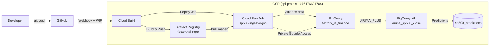
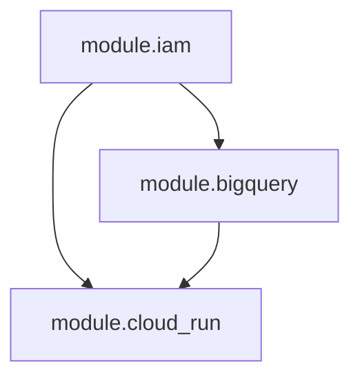
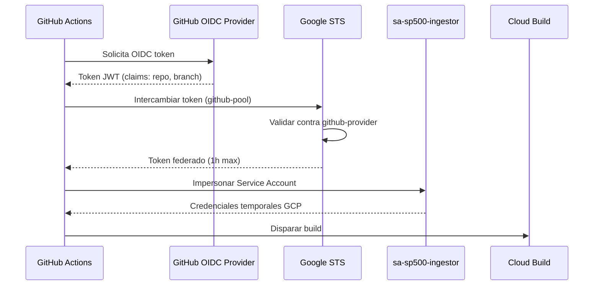
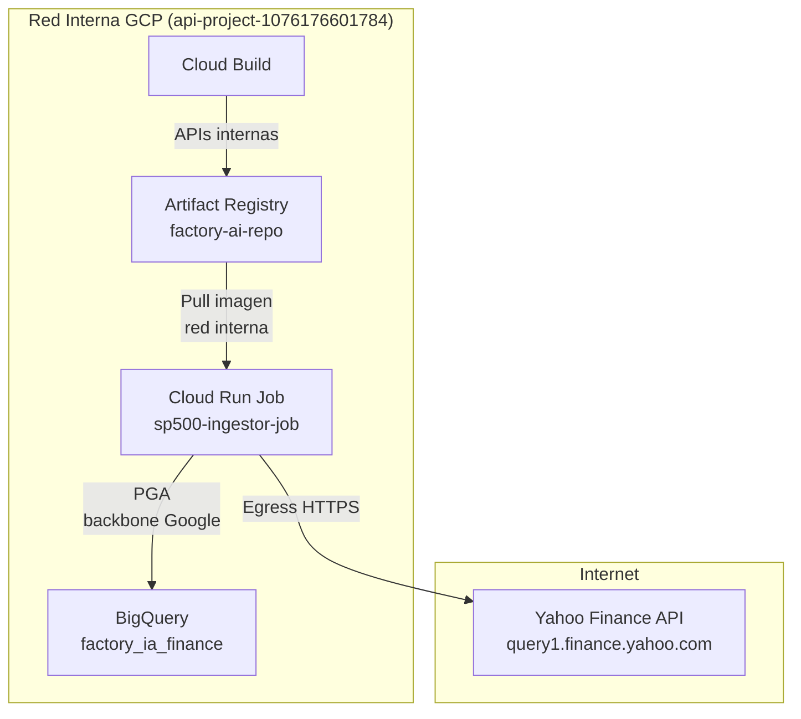

# Arquitectura — SP500 BigQuery ML Pipeline

Pipeline automatizado que ingesta datos historicos del S&P 500 desde Yahoo Finance, los almacena en BigQuery y entrena modelos de series temporales ARIMA_PLUS con BigQuery ML para generar predicciones del precio de cierre. Todo el ciclo de vida se orquesta mediante Cloud Build, se despliega como Cloud Run Job y la infraestructura se gestiona con Terraform.

---

## 1. Flujo del Pipeline

```
GitHub Push → Cloud Build → Artifact Registry → Cloud Run Job → BigQuery ML
```

1. El desarrollador hace `git push` al repositorio `factory-ai-sp500` en GitHub.
2. Un webhook de GitHub dispara Cloud Build via Workload Identity Federation (WIF) — sin llaves JSON.
3. Cloud Build construye la imagen Docker definida en `src/ingesta/Dockerfile`.
4. La imagen se sube a Artifact Registry (`factory-ai-repo`, region `us-central1`).
5. Cloud Build despliega/actualiza el Cloud Run Job `sp500-ingestor-job`.
6. El Cloud Run Job se ejecuta: el script Python (`main.py`) descarga datos historicos del S&P 500 via `yfinance`.
7. Los datos crudos se escriben en la tabla `factory_ia_finance.sp500_history` de BigQuery.
8. Se ejecuta `CREATE OR REPLACE MODEL` para entrenar/re-entrenar el modelo `arima_sp500_close` (ARIMA_PLUS) sobre la columna `Close`.
9. Las predicciones resultantes se escriben en la tabla `factory_ia_finance.sp500_predictions`.

---

## 2. Diagrama de Arquitectura



---

## 3. Arbol de Archivos

```
SP500_Bigquery_ML/
├── ENVIRONMENT.md                  # Manifiesto de entorno — source of truth
├── .gitignore                      # Exclusiones de git
├── cloudbuild/
│   └── cloudbuild.yaml             # Pipeline CI/CD: build, push, deploy
├── docs/
│   └── ARCHITECTURE.md             # Este documento
├── src/
│   └── ingesta/
│       ├── Dockerfile              # Imagen del job de ingesta
│       ├── requirements.txt        # Dependencias Python (yfinance, google-cloud-bigquery)
│       ├── main.py                 # Punto de entrada: ingesta + entrenamiento ML
│       └── config.py               # Variables de entorno centralizadas
└── terraform/
    ├── main.tf                     # Root module: invoca sub-modulos
    ├── variables.tf                # Variables de entrada del root module
    ├── outputs.tf                  # Outputs del root module
    ├── providers.tf                # Configuracion de providers google/google-beta
    ├── backend.tf                  # Backend remoto en GCS
    ├── terraform.tfvars            # Valores concretos de variables
    └── modules/
        ├── bigquery/
        │   ├── main.tf             # Dataset + tablas sp500_history, sp500_predictions
        │   ├── variables.tf
        │   └── outputs.tf
        ├── cloud_run/
        │   ├── main.tf             # Artifact Registry repo + Cloud Run Job
        │   ├── variables.tf
        │   └── outputs.tf
        └── iam/
            ├── main.tf             # Service Account, WIF pool/provider, IAM bindings
            ├── variables.tf
            └── outputs.tf
```

---

## 4. Dependencias de Terraform

### Providers y Versiones

```hcl
terraform {
  required_version = ">= 1.5.0"
  required_providers {
    google      = { source = "hashicorp/google",      version = "~> 5.0" }
    google-beta = { source = "hashicorp/google-beta",  version = "~> 5.0" }
  }
}
```

### Backend

```hcl
backend "gcs" {
  bucket = "tfstate-api-project-1076176601784"
  prefix = "terraform/state"
}
```

### Grafo de Dependencias entre Modulos

```
module.iam          → (sin dependencias)
module.bigquery     → depends_on: [module.iam]
module.cloud_run    → depends_on: [module.iam, module.bigquery]
```



### Recursos Clave por Modulo

| Modulo | Recursos Terraform |
|---|---|
| **iam** | `google_service_account`, `google_iam_workload_identity_pool`, `google_iam_workload_identity_pool_provider`, `google_service_account_iam_binding`, `google_project_iam_member` |
| **bigquery** | `google_bigquery_dataset`, `google_bigquery_table` x2 (`sp500_history`, `sp500_predictions`) |
| **cloud_run** | `google_artifact_registry_repository`, `google_cloud_run_v2_job` |

> **Nota:** El modelo ARIMA_PLUS (`arima_sp500_close`) se crea via SQL (`CREATE OR REPLACE MODEL`) en runtime dentro del Cloud Run Job, no via Terraform.

---

## 5. Identidad — Workload Identity Federation (WIF)

### Componentes

| Componente | Recurso Terraform | Valor |
|---|---|---|
| Workload Identity Pool | `google_iam_workload_identity_pool` | `github-pool` |
| Pool Provider | `google_iam_workload_identity_pool_provider` | `github-provider` (OIDC, issuer: `https://token.actions.githubusercontent.com`) |
| Service Account | `google_service_account` | `sa-sp500-ingestor@api-project-1076176601784.iam.gserviceaccount.com` |
| IAM Binding | `google_service_account_iam_binding` | `roles/iam.workloadIdentityUser` |

### Flujo de Autenticacion

1. GitHub Actions solicita un OIDC token al proveedor de identidad de GitHub.
2. El token incluye claims del repositorio (`factory-ai-sp500`) y rama.
3. El token se envía a Google Security Token Service (STS).
4. STS valida el token contra la configuracion del `github-pool` / `github-provider`.
5. STS emite un token federado de corta duracion.
6. El token federado se usa para impersonar la Service Account `sa-sp500-ingestor`.
7. Se obtienen credenciales temporales de GCP para invocar Cloud Build y demas servicios.



### Principios de Seguridad

- **Sin llaves JSON**: no se exportan ni almacenan service account keys.
- **Tokens de vida corta**: maximo 1 hora de validez.
- **Scope restringido**: el pool provider filtra por repositorio y rama.
- **Menor privilegio**: la SA solo tiene los roles estrictamente necesarios.

### Roles de la Service Account

| Rol | Proposito |
|---|---|
| `roles/cloudbuild.builds.editor` | Disparar builds en Cloud Build |
| `roles/artifactregistry.writer` | Push de imagenes Docker a Artifact Registry |
| `roles/run.admin` | Desplegar y ejecutar Cloud Run Jobs |
| `roles/bigquery.dataEditor` | Escritura en tablas de BigQuery |
| `roles/bigquery.jobUser` | Ejecutar queries SQL y entrenar modelos BQML |

---

## 6. Variables de Entorno — Cloud Run Job

| Variable | Valor | Descripcion |
|---|---|---|
| `GCP_PROJECT_ID` | `api-project-1076176601784` | Proyecto GCP |
| `BQ_DATASET` | `factory_ia_finance` | Dataset BigQuery |
| `BQ_TABLE_HISTORY` | `sp500_history` | Tabla de datos historicos crudos |
| `BQ_TABLE_PREDICTIONS` | `sp500_predictions` | Tabla de predicciones del modelo |
| `BQ_LOCATION` | `us-central1` | Ubicacion del dataset |
| `TICKER_SYMBOL` | `^GSPC` | Ticker del S&P 500 en Yahoo Finance |
| `HISTORY_PERIOD` | `5y` | Periodo de datos historicos a descargar |
| `ML_MODEL_NAME` | `arima_sp500_close` | Nombre del modelo BQML |

Estas variables se definen en Terraform dentro del bloque `env` del recurso `google_cloud_run_v2_job` y se leen en Python via `os.environ` en `config.py`.

---

## 7. Red — Comunicacion Interna GCP

| Ruta | Mecanismo | Detalle |
|---|---|---|
| Cloud Run → BigQuery | Private Google Access (PGA) | Trafico por backbone interna de Google, sin salir a internet |
| Cloud Run → Artifact Registry | Red interna | Pull de imagen en la misma region `us-central1` |
| Cloud Build → Artifact Registry | APIs internas | Comunicacion intra-proyecto |
| Cloud Run → Yahoo Finance | Egress a internet | Unica salida externa: `query1.finance.yahoo.com` (API yfinance) |

- **Sin VPC Connector requerido**: BigQuery y Artifact Registry son APIs de Google accesibles via PGA automaticamente.
- **Sin ingress**: Cloud Run Job no expone endpoints HTTP (es un Job, no un Service).
- **Egress externo**: la unica comunicacion a internet publica es la descarga de datos via yfinance.



---

## 8. Esquema de Datos (BigQuery)

### Dataset: `factory_ia_finance`

**Ubicacion:** `us-central1`
**Proyecto:** `api-project-1076176601784`

### Tabla: `sp500_history`

Datos crudos del S&P 500 descargados via yfinance.

| Columna | Tipo | Descripcion |
|---|---|---|
| `Date` | `DATE` | Fecha de la sesion bursatil |
| `Open` | `FLOAT64` | Precio de apertura |
| `High` | `FLOAT64` | Precio maximo del dia |
| `Low` | `FLOAT64` | Precio minimo del dia |
| `Close` | `FLOAT64` | Precio de cierre (variable objetivo para ML) |
| `Volume` | `INT64` | Volumen de operaciones |
| `ingested_at` | `TIMESTAMP` | Momento de la ingesta |

### Tabla: `sp500_predictions`

Predicciones generadas por el modelo ARIMA_PLUS.

| Columna | Tipo | Descripcion |
|---|---|---|
| `forecast_timestamp` | `TIMESTAMP` | Fecha/hora de la prediccion |
| `forecast_value` | `FLOAT64` | Valor predicho del precio de cierre |
| `standard_error` | `FLOAT64` | Error estandar de la prediccion |
| `confidence_level` | `FLOAT64` | Nivel de confianza (ej. 0.95) |
| `prediction_interval_lower_bound` | `FLOAT64` | Limite inferior del intervalo de confianza |
| `prediction_interval_upper_bound` | `FLOAT64` | Limite superior del intervalo de confianza |
| `model_trained_at` | `TIMESTAMP` | Momento en que se entreno el modelo |

### Modelo: `arima_sp500_close`

```sql
CREATE OR REPLACE MODEL `factory_ia_finance.arima_sp500_close`
OPTIONS (
  model_type = 'ARIMA_PLUS',
  time_series_timestamp_col = 'Date',
  time_series_data_col = 'Close'
) AS
SELECT Date, Close
FROM `factory_ia_finance.sp500_history`;
```

---

## 9. Referencias Cruzadas

| Parametro | Valor | Origen |
|---|---|---|
| Project ID | `api-project-1076176601784` | `ENVIRONMENT.md` |
| Region | `us-central1` | `ENVIRONMENT.md` |
| Dataset | `factory_ia_finance` | `ENVIRONMENT.md` |
| Tabla historicos | `sp500_history` | `ENVIRONMENT.md` |
| Tabla predicciones | `sp500_predictions` | `ENVIRONMENT.md` |
| Service Account | `sa-sp500-ingestor` | `ENVIRONMENT.md` |
| Artifact Registry repo | `factory-ai-repo` | `ENVIRONMENT.md` |
| Cloud Run Job | `sp500-ingestor-job` | `ENVIRONMENT.md` |
| Modelo BQML | `arima_sp500_close` | Definido en esta arquitectura |
| Terraform backend bucket | `tfstate-api-project-1076176601784` | Definido en esta arquitectura |
